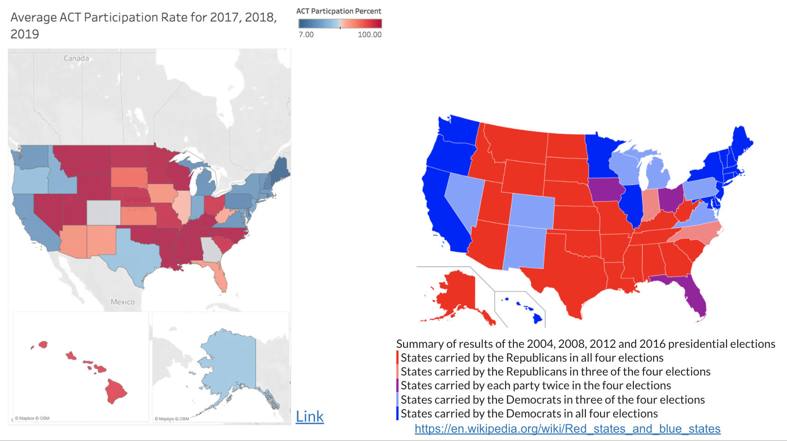
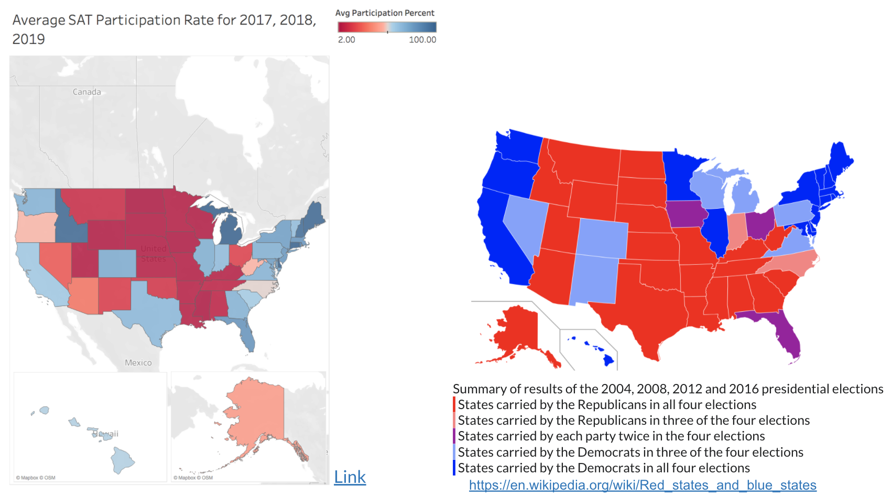
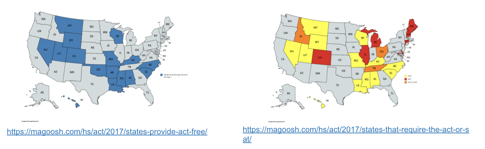

# Project 1: Do Politics Play a Role in SAT and ACT Participation Rates?

### Overview

While analyzing the 2017, 2018, and 2019 data I came across what looks like a possible correlation between Politics and ACT and SAT participation rates. Republican states tend to have a higher ACT participation rate while Democrat states tend to have a higher SAT participation rate. Do Republican states have more state mandation? Are states providing the tests for free? These are some of the questions that sparked my interest.

### Executive Summary

In this project I chose the task of finding out if politics play a role in SAT and ACT participation rates. Before I was able to analyze the data there were a few data issues that needed to be resolved. After using common data cleaning methods I merged all three years into a final dataframe. After cleaning my data I had a couple of primary findings that stood out to me. Some of these were Colorado had a 70 % decrease in act participation rates from 2017 to 2018 and an 89% increase in SAT participation rates from 2017 to 2018 and Illinois had a 90% increase in SAT participation rates from 2017 to 2018. Two other interesting findings I found were that middle states and southern states are predominantly ACT focused meanwhile Eastern and Western states are predominantly SAT focused and there is an inverse relationship between participation rates and mean scores.

When comparing the average ACT and SAT participation rates for 2017, 2018, and 2019 to the political map it showed a very intersting correlaton. A majority of Republican states had a very high ACT participation for 2017, 2018, and 2019 meanwhile a majority of Democrat states had a very high SAT participation rate for 2017, 2018, 2019. So, this begs the question do politics play a role in SAT and ACT particiaption rates?

### Table of Contents

- [Data Issues](###Data%Issues)
- [Primary Findings](###Primary%Findings)
- [Test Taking Bias](###Test%Taking%Bias)
- [Average ACT Participation Rate for 2017, 2018, 2019](###Average%ACT%Participation%Rate%for%2017,%2018,%2019)
- [Average SAT Participation Rate for 2017, 2018, 2019](###Average%SAT%Participation%Rate%for%2017,%2018,%2019)
- [So, Does Politics Play a Role in SAT and ACT Participation Rates?](###So,%Does%Politics%Play%a%Role%in%SAT%and%ACT%Participation%Rates?)
- [Conclusions & Recommendations](###Conclusions%&%Recommendations)
- [Citations](###Citations)
---

### Data Issues 

Before I started analyzing the data there were multiple data issues I encountered. 

- All of the 'Participation' columns were objects instead of floats.
- Maryland in the 2017 SAT dataset the column 'math_sat' needed to be changed from 52 to 524.
- Maryland in the 2017 ACT dataset the column 'science_act' needed to be changed 2.3 from 23.2.
- Wyoming in the 2017 ACT dataset the column 'composite' needed to be changed 20.2x from 20.2.
- In the 2017 dataset there was an extra row that needed to be dropped.
- In the 2018 ACT dataset there was an extra Maine row that needed to be dropped.
- In the 2019 SAT dataset there were two extra rows that needed to be dropped they were 'Puerto Rico' and 'Virgin Islands'
- In the 2019 ACT dataset the last row needed to be dropped to match the 2019 SAT dataset
- In the final dataset Florida's participation rate in 2017 is 83% then in 2018 it is 56% then in 2019 it is 100%. However in a report from college board Florida, in 2018 had a 97% participation rate. 

After resolving these issues I merged all of the dataframes together making a final and complete overview of all of the given data.

---

### Primary Findings

After cleaning my data, I had a couple of primary findings that stood out to me.

- Colorado had a 70 % decrease in act participation rates from 2017 to 2018 and an 89% increase in SAT participation rates from 2017 to 2018. This is because Colorado instituted a state mandation for the SAT instead of the ACT. Requiring all students to take the sat.
- Illinois had a 90% increase in SAT participation rates from 2017 to 2018. This is because thet also instituted a state mandation for the SAT requiring all students to take the SAT test.
- Middle states and southern states are predominantly ACT focused meanwhile Eastern and Western states are predominantly SAT focused.
- There is an inverse relationship between participation rates and mean scores.

---

### Test Taking Bias

While analyzing my data I wanted to see the correlation between certain values and one of them was the participation rate and the total mean scores.  Schools that tend to have lower participation rates tend to have higher test scores. Why is this?

 

This is because the low percent of people who participate in these test are more motivated to do well on these tests than people who are forced to take these test in other states.

---

### Average ACT Participation Rate for 2017, 2018, 2019

As seen on the left there is a divergent choropleth plot that displays the average ACT participation rate for 2017, 2018, and 2019. The red meaning that participation rate is closer to 100% and the blue meaning participation rate closer to 0%. 

On the right is a map of the summary results of the 2004, 2008, 2012, and 2016 presidental election. 

 

We can see it look like more of the Rebublican states prefer the ACT and the Democrat states do not. However, based on the test taking bias the states where they are closer to 0% are averaging higher mean total scores than states closer to 100%.

- Link to the tableau map: https://public.tableau.com/profile/aidan.curle#!/vizhome/DivergentChloropethMapfortheAverageSATParticipationacross20172018and2019/Sheet1?publish=yes

---

### Average SAT Participation Rate for 2017, 2018, 2019

As seen on the left there is a divergent choropleth plot that displays the average SAT participation rate for 2017, 2018, and 2019. This time red meaning that participation rate is closer to 0% and the blue meaning participation rate closer to 100%. 

On the right is a map of the summary results of the 2004, 2008, 2012, and 2016 presidental election. 

 

We can see it look like more of the Democrat states prefer the SAT and the Democrat states do not. However, based on the test taking bias the states where they are closer to 0% are averaging higher mean total scores than states closer to 100%.

- Link to the tableau map: https://public.tableau.com/profile/aidan.curle#!/vizhome/DivergentChloropethMapfortheAverageSATParticipationRateacross20172018and2019/Sheet2?publish=yes

---

# So, Does Politics Play a Role in SAT and ACT Participation Rates?

### Not Necessarily

In the map to the left the blue states indicate where the ACT is free to take. In the map to the right the yellow and orange states indicate where the ACT is mandatory to take.

 

Just because a state with a higher participation is in a Rebublican state or Democrat state does not mean that participation rate is caused because of the political environment in that state. 

Comparing the average ACT participation rates for 2017, 2018, and 2019 to these maps you can see a lot of crossover with middle and southern states that have high particpation rates, free tests, and state mandation. 

---

### Conclusions & Recommendations

If states would like a guaranteed increase in participation rate for a given state I would recommend offering the test for free and making it mandated in that specific state. This is why there is such a high percentage of people in the southern and middle states who take the ACT instead of the SAT. 

However, that route is not possible to take for every state.

Recommendations for states who do not have a mandation:
- **First**, states could offer the SAT / ACT during school hours. This makes it so the students do not have to schedule it themselves and make accomadtions for going to the test. Which both could be big reasons why students do not take the tests. 
- **Second**, states should cover all parts of the exam fees. For students who get free lunches and free resources it is unjust to make them pay upwards of $50+ to take one of these exams and prepare for the exam. Not covering all the fees could also play a role in students not being able to actually take the test.
- **Third**, increasing access to honors and AP courses. Students who take these classes are far more ready for the SAT and ACT tests. Increasing access to these test will aid in increasing participation while also increasing mean total scores.
- **Fourth**, increasing access to PSAT/NMSQT. In my school we had to pay for this course and had to stay after school for a few hours a week which is not possible for some students. Increasing access to the PSAT/NMSQT will lead to a higher participation rate and a higher mean total score.

---

### Citations

Also, credit to James Pecore, Haley Taft, Chris Johnson, Lydia Kajeckas, David Lee, Eric Heidbreder for help throughout this project.

- https://co.chalkbeat.org/2015/12/23/21092477/goodbye-act-hello-sat-a-significant-change-for-colorado-high-schoolers
- https://www.testive.com/colorado-sat-change-2017/
- https://reports.collegeboard.org/pdf/2018-florida-sat-suite-assessments-annual-report.pdf
- https://www.testive.com/illinois/
- https://seaborn.pydata.org/examples/many_pairwise_correlations.html
- https://academy.datawrapper.de/article/134-what-to-consider-when-creating-choropleth-maps
- https://github.com/ebmdatalab/openprescribing/issues/347
- https://en.wikipedia.org/wiki/Red_states_and_blue_states
- https://www.cnn.com/2014/03/05/living/sat-test-changes-schools/index.html
- https://magoosh.com/hs/act/2017/states-that-require-the-act-or-sat/
- https://magoosh.com/hs/act/2017/states-provide-act-free/
- https://www.hanoverresearch.com/media/Best-Practices-to-Increase-SAT-Participation-1.pdf
