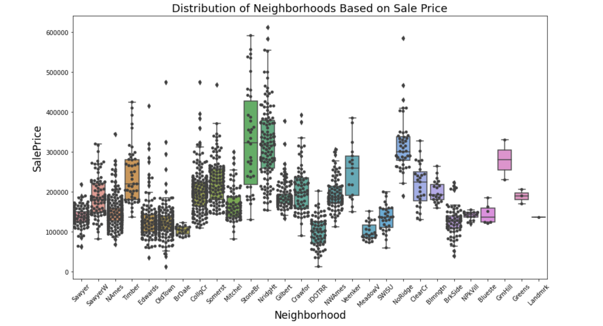

# Regression Model to Predict Sale Price of a Home

Aidan Curley | US-DSIR-720 | 08.14.2020

## Problem Statement  

Being the lead data scientist at Gold Swan Capital I was given the task of creating a model that will shorten our timeframe for evaluating a potential real estate investment property. This model should inform us on the features that have an effect on price when we go to buy the house and when we go to sell the house. Our model should be able to predict the price within \$30,000 since this will give us room to negotiate, renovate, and eventually resell the property. 

I will use the Ames Iowa housing dataset to build a baseline regression model to predict the sale price of a house in order to evaluate if that property is a potential real estate investment.

## Table of Contents

- [Project Directory](#projectdirectory)
- [Executive Summary](#executivesummary)
- [Feature Selection](#featureselection)
- [Modelling Process](#modellingprocess)
- [Future Steps](#futuresteps)
- [Conclusions & Recommendations](#c&r)
- [Citations](#cite)


<a name="projectdirectory"></a>
## Project Directory
    
```
project_2-master
|__ assets 
|   |__ goldswan.png
|   |__ neighborhoodboxplot.png
|__ code       
|   |__ 01_continous_cleaning.ipynb  
|   |__ 02_discrete_cleaning.ipynb  
|   |__ 03_ordinal_cleaning.ipynb  
|   |__ 04_nominal_cleaning.ipynb  
|   |__ 05_function_cleaning.ipynb  
|   |__ 06_model_submission.ipynb 
|__ data  
|   |__ continous_test.csv  
|   |__ continous_train.csv  
|   |__ discrete_test.csv  
|   |__ discrete_train.csv  
|   |__ merged_test.csv  
|   |__ merged_train.csv  
|   |__ new_submission.csv  
|   |__ ordinal_test.csv  
|   |__ ordinal_train.csv  
|   |__ ridge_submission.csv   
|   |__ test.csv  
|   |__ train.csv 
|__ capstone_presentation.pdf  
|__ README.md  
```
<a name="executivesummary"></a>
## Executive Summary

I was given a dataset of Ames Iowa houses with a total of 80 columns for features of the houses and one column for the sale price. There were four different types of data: nominal, ordinal, continous, and discrete. I went through all of the 80 columns and picked the columns in those four categories that can best be replicated for future data. There were features in this dataset that could have been used to better predict the sale price for this specifc city however would not have been translated nicely if later down the line we wanted to input data from different cities across the United States.   

With these specific features that I chose for the regression model I hope that this model can be replicated and used as a tool to evaluate a real estate investment deal. When new deals come across the table we can run them through this model and see if the price for that house seems satisfactory for an investment or not. When we are looking to sell a property we can also run that property though this model and predict what we can potentially get from the house.

<a name="featureselection"></a>
## Feature Selection

I wanted to focus on features that most real estate agents can easily find out for us. This was important so we can evaluate deals as quickly and as easily as possible. After selecting a handful of features I decided to check the correlation between these features and the 'SalePrice' column that was provided in the training csv file. After finding out which features had the most correlation with the 'SalePrice' columns and were easy features that a real estate agent can get for us I had to clean those features.

**The features I selected were:**
- Total Basement Square Feet (Total Bsmt SF)
- First Floor Square Feet (1st Flr SF)
- Above Grade (Ground) Living Area Square Feet (Gr Liv Area)
- Garage Area (Garage Area)
- Neighborhood (Neighborhood)
- Overall Quality (Overall Qual) (The real estate agent will give their best guess)   
- Exterior Quality (Exter Qual) (The real estate agent will give their best guess)  
- Basement Quality (Bsmt Qual) (The real estate agent will give their best guess)  
- Kitchen Quality (Kitchen Qual) (The real estate agent will give their best guess)
- Year Built (Year Built)  
- Full Bath (Full Bath)  
- Total Rooms Above Ground (TotRms AbvGrd)  

These features will allow us to deploy models very quickly and allow us to replicate on future markets. This was very important to selecting these features. After picking these features I also wanted to add the relationship between some of these features to our feature list as well. I wanted to emphasize houses that had a relationship with Gr Liv Area & Total Bsmt SF, Overall Qual & Exter Qual, Overall Qual & Gr Liv Area, and Gr Liv Area & Garage Area. Although these features could have added multicollinearity they are important relationships that I believe could impact the overall sale price of home. 

Only using one nominal feature was an interesting choice. I wanted to use as little features as possible that can be replicated to different markets. As everyone knows in real estate the most import contributor to a house price is location, location, and again location. So with that for my nominal features I only used neighborhood. 

  

As we can see in the boxplot above there are a lot of houses in that \$100,000 to \$200,000 range. We can also see that certain neighborhoods on average are way more expensive than other neighborhoods. This is something to rememeber and take into consideration when evaluating a potenital investment. Another interesting idea to take into consideration is why are there so many houses in this dataset in certain neighborhoods and not other neighborhoods? Why are people moving out? Why are people moving in? These are all follow up questions we will have to rememeber when evaluating a house. 

<a name="modellingprocess"></a>
## Modelling Process  

The modelling process had multiple steps.      

The first step in my modelling process was finding out my baseline score with my cleaned dataset with my selected features. With my model the RMSE (Root Mean Square Error) to beat was 80039.93 for the training dataset and 77354.33 for the testing dataset. The RMSE in this case represent how off we are in terms of a dollar amount from the actual sale price. With this model we are \$77,354.33 off the actual sale price of the home.


After evaluating the baseline score I then moved onto predicting the best score I could with my chosen features. I instantiated a new linear regression model and passed my features into this models train test split. This model performed expontentially better than the baseline model. The training RMSE was 28091.21 and the testing RMSE was 28408.52. 

After I did this model I instantiated another model however this was with using standard scaler and ridge regression. I wanted to see if scaling my features and doing ridge regression would improve my scores. This time I used R2 to score this model. The R2 for this model was .87 on training data in train test split and .87 on testing data in train test split. Comparing this to my model without scaled features for my R2 I got .88 on the training data in train test split and .86 on the testing data in train test split. I did the same process with lasso regression and I achieved about the same R2 scores, I got .88 on the training data in train test split and .87 on the testing data in train test split.

<a name="futuresteps"></a>
## Future Steps

As we move forward looking for potential investment properties this model will have to improve. Although it is satisfactory for getting an estimation on what we could buy/sell the house for it will need to improve. Especially with residential properties being under or over \$30,000 is not the best. However, if we see a potential property that catches our eye this model can be extremely helpful. We can run the properties features through our model and evaluate what needs to get fixed. Such as improving the overall quality of house from a 4 to a 10 will increase our potential sale price. 

In the future we plan to tweak and add to this model as we expand to new markets. Performing this model on different markets will show us what else we need to add that we did not have in version 1.0. Possibly using a different machine learning model will produce a better RMSE than just a linear regression model. We will continously tweak and edit the code to make this model predict better and be more reproduceable to future datasets.

Once we get a satisfactory replicatable model we hope to add a section to our website that will make the process of predicting easier. This section on our website will have places to input the features we use to predict the sale price so we don't have to manually enter them into a csv file and run all of the notebooks again. This will be able to give you a prediction instantly. This feature will only be accessible by our team of investors.

<a name="c&r"></a>
## Conclusions & Recommendations 

First of all this is not a model that should be used to predict and then simply buy the property based on this estimation, since there are many aspects of a house that cannot be accounted for by a model. 

Depending on your specifc investment strategies these are some things to take into consideration before purchasing an investment property:

- School District
- Neighbors
- Economic Climate
- Supply and Demand 
- Interest Rates
- Area Demographics

Use this model as a ballpark number in mind and then go research that specific property in more detail. If your strategy is a fix and flip you might search for properties with quality features less than 5 and focus on improving them to 8+. You can then predict if I raise this houses quality features how much does that raise the sale price of a house. If the numbers make sense then go research the property in more detail. If your strategy is to find tenants you might want to focus on different qualities that aren't in this model such as paint colors, quality of furniture, ease of access to public transportation, etc. 

As I tweak and add to this model I hope to make it more accurate and replicatable to different markets. 

<a name="cite"></a>
## Citations

Special thanks to David Lee, Eric Heidbreder, Lydia Kajeckas, Haley Taft, and Chris Johnson on certain parts of this project.

- https://stackoverflow.com/questions/35713093/how-can-i-compare-two-lists-in-python-and-return-not-matches/35713174
- https://stackoverflow.com/questions/49188960/how-to-show-all-of-columns-name-on-pandas-dataframe/49189503

  
